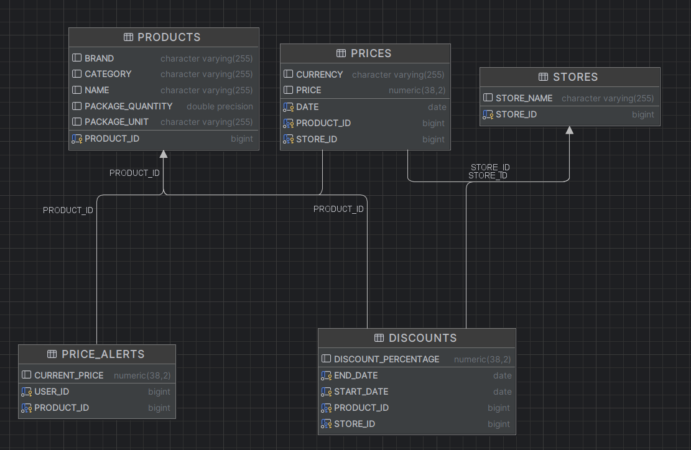

# Price Comparator Backend  

## 1. Project structure

The project uses spring boot and a h2 database. All database
models are stored in the [model](./src/main/java/com/example/accesachallenge/model)
directory. This is the entity relationship diagram:


Each model has a [repository](./src/main/java/com/example/accesachallenge/repository)
that implements the queries necessary for the app. In the
[main](./src/main/java/com/example/accesachallenge/AccesaChallengeApplication.java) file
tables are cleared and populated with the provided [csv data](./data). The [shopping controller](./src/main/java/com/example/accesachallenge/controller/ShoppingController.java)
handles most logic, mapping the following endpoints:
* /api/optimize-shopping-list
* /api/best-discounts
* /api/new-discounts
* /api/product-price-history
* /api/filtered-product-price-history
* /api/value-per-unit
* /api/add-price-alert
* /api/fetch-price-alerts

## 2. Run the app
1. Install JDK 17 (required).
2. Clone the repository.
3. Run in the project root:
   - Windows: `gradlew.bat bootRun`
   - macOS / Linux: `./gradlew bootRun`
4. Access the endpoints at `http://localhost:8080/api`

## 3. Assumptions
For testing purposes, there is a hardcoded `currentDate` value in the 
`ShoppingController`. Also, the app clears the database between runs 
(so that new `.csv` data can be loaded). The app considers the best discount if multiple
discounts have overlapping dates.

## 4. API request examples

### /optimize-shopping-list
```http request
POST http://localhost:8080/api/optimize-shopping-list
Content-Type: application/json

[
  "P001",
  "P002"
]
```

### /best-discounts
```http request
POST http://localhost:8080/api/best-discounts
```

### /new-discounts
```http request
POST http://localhost:8080/api/new-discounts
```

### /product-price-history
```http request
POST http://localhost:8080/api/product-price-history
Content-Type: application/json

{
  "productId": "P001"
}
```

### /filtered-product-price-history
```http request
POST http://localhost:8080/api/filtered-product-price-history
Content-Type: application/json

{
  "storeName": "lidl",
  "brand": "Zuzu"
}
```

### /value-per-unit
```http request
POST http://localhost:8080/api/value-per-unit
Content-Type: application/json

[
  "P001"
]
```

### /add-price-alert
```http request
POST http://localhost:8080/api/add-price-alert
Content-Type: application/json

{
  "userId": 1001,
  "productId": "P001"
}
```

### /fetch-price-alerts
```http request
POST http://localhost:8080/api/fetch-price-alerts
Content-Type: application/json

{
  "userId": 1001
}
```